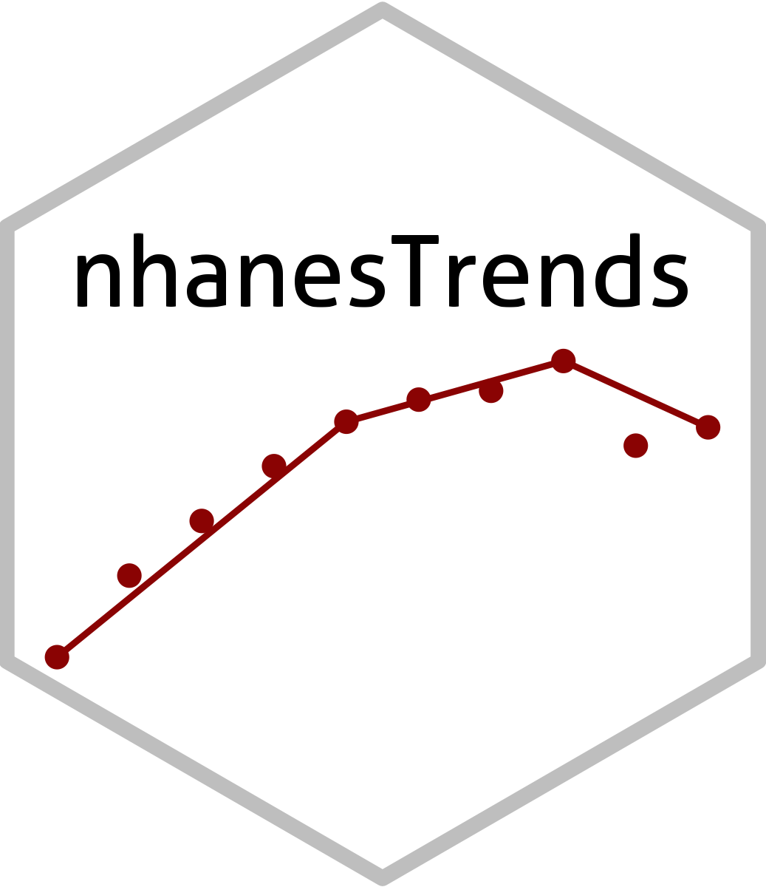

---

### Work in progress

This R package works fine but my teammates and I are still developing it. Please, check out the public site and send me your feedback.

Check out the app here: https://bcjaeger.shinyapps.io/nhanesShinyBP/

<!-- modify this form HTML and place wherever you want your form -->
<form
  action="https://formspree.io/f/xeqdjabg"
  method="POST"
>
  <label>
    Your email:
    <input type="email" name="email">
  </label>
  <label>
    Your message:
    <textarea name="message"></textarea>
  </label>
  <!-- your other form fields go here -->
  <button type="submit">Send</button>
</form>
